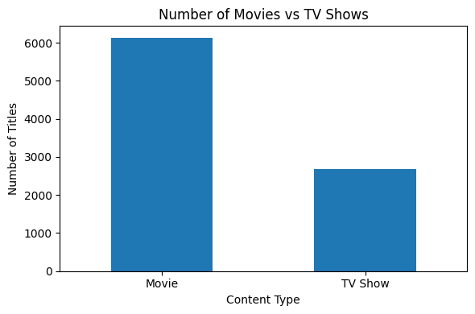
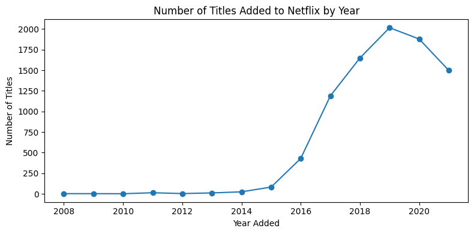
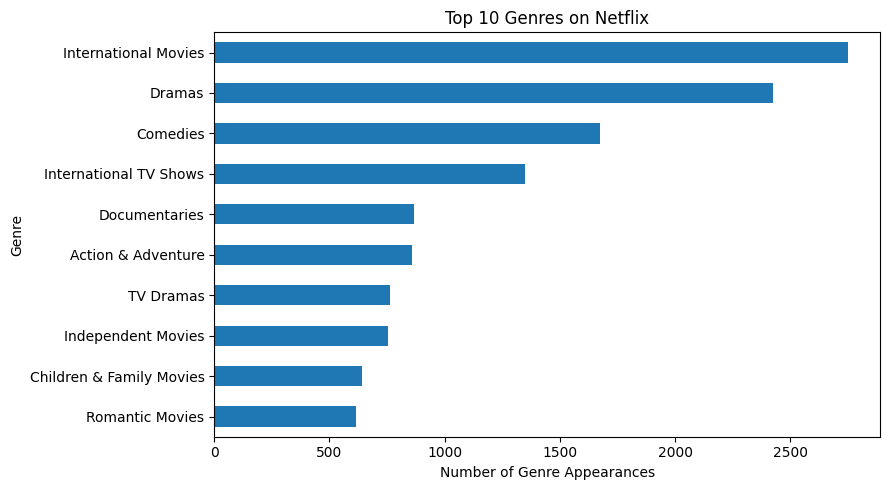

# Netflix Content Strategy Analysis

Exploratory analysis of Netflix's catalog evolution, content mix, and genre distribution using Python.

## Overview

This project analyzes how Netflix's content catalog evolved between 2008 and 2021 using a public dataset of 8,807 Movies and TV Shows.

The analysis focuses on three questions:

- How is Netflix's catalog distributed between Movies and TV Shows?
- How did the number of titles added to Netflix change over time?
- Which genre categories appear most frequently in the catalog?

The project uses exploratory data analysis to establish a baseline understanding of Netflix's content library and support broader analysis of content strategy and genre trends.

## Tech Stack

- Python
- pandas
- Matplotlib
- Jupyter Notebook

## Project Context

This analysis originated from a five-person course project on Netflix content strategy.

My contribution focused on:

- dataset overview and exploratory analysis
- data preparation for descriptive analysis
- Movie vs. TV Show distribution
- catalog growth over time
- genre frequency analysis
- data visualization and interpretation

## Key Findings

### 1. Movies make up the majority of the catalog

The dataset contains **6,131 Movies** and **2,676 TV Shows**, showing that Netflix's catalog during this period was substantially more movie-heavy.

### 2. Catalog expansion accelerated after 2015

The number of titles added to Netflix increased sharply during the second half of the 2010s, with the highest observed number of additions occurring in **2019**.

### 3. International content and drama-related genres are highly represented

After splitting multi-label genre entries into individual genre appearances, the most frequent categories were:

- **International Movies:** 2,752 appearances
- **Dramas:** 2,427 appearances
- **Comedies:** 1,674 appearances

Because a single title can belong to multiple genres, these values represent **genre appearances rather than unique title counts**.

